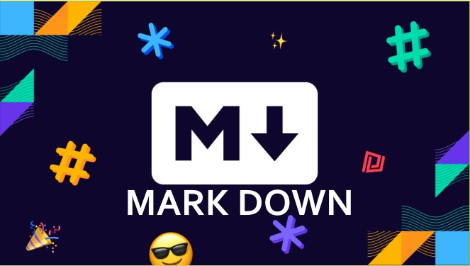

## <font color = #BBFF24>INTRODUCCIÓN.</font>

- **Markdown** es un lenguaje de marcado ligero que se utiliza para formatear texto
de manera sencilla y eficiente.
- Fue diseñado por John Gruber con la intención de ser fácil de escribir y leer, incluso
en su forma sin renderizar.
- Markdown se utiliza comúnmente para crear documentos, notas, blogs, y
contenido en plataformas como GitHub, donde es muy popular para archivos
README, documentación y wikis.!
- En términos prácticos, Markdown permite aplicar estilos como encabezados,
listas, enlaces, imágenes y bloques de código usando una sintaxis clara y
minimalista.
## <font color = #BBFF24><ins>VENTAJAS DE MARKDOWN</ins></font>
- **Simplicidad**: Fácil de aprender y usar.
- **Portabilidad**: Se puede convertir a HTML, PDF y otros formatos.
- **Compatibilidad**: Usado en plataformas como GitHub, Reddit, y Slack.
- **Legibilidad**: El texto es fácil de leer incluso sin renderizar.
## <font color = #BBFF24>SINTAXIS BÁSICA DE MARKDOWN.</font>
- **<ins>Encabezados></ins>**
• Usa # para títulos. Cuantos más #, menor el nivel del encabezado.
## <font color = #BBFF24>SINTAXIS BÁSICA DE MARKDOWN.</font>
- **<ins>Énfasis</ins>**
## <font color = #BBFF24>SINTAXIS BÁSICA DE MARKDOWN.</font>
- **<ins>Marcado de color para resaltar texto y citas</ins>**
- Se usa > para marcar texto como cita.
- Se usa ==texto== para marcado de texto
- **<ins>Divisores y presentaciones</ins>**
- Usa --- para crear una lines horizontal completa y crear un separador.
## <font color = #BBFF24>SINTAXIS BÁSICA DE MARKDOWN.</font>
- **<ins>Tablas</ins>**
- Se usa | para marcar las columnas y entre ellas se pone el texto que queremos que
aparezca.
## <font color = #BBFF24>SINTAXIS BÁSICA DE MARKDOWN.</font>
- **<ins>Listas</ins>**
- Puedes crear una lista sin ordenar. Para ello, coloca -, * o + antes de una o más
  líneas de texto.
- **<ins>Listas ordenadas</ins>**
- Puedes crear una lista ordenada. Para ello, pon la numeración seguida de un punto.
- <ins>NOTA.</ins> Puedes combinar ambas listas y crear sublistas utilizando el tabulador.
  ## <font color = #BBFF24>SINTAXIS BÁSICA DE MARKDOWN.</font>
- **<ins>Listas de tareas</ins>**
- Para crear una lista de tareas, debe añadir como prefijo un guion y espacio, seguido
  de [ ] a los elementos de la lista. Para marcar una tarea como completada, use [x].
  ## <font color = #BBFF24>SINTAXIS BÁSICA DE MARKDOWN.</font>
- **<ins>Modelos de color compatibles</ins>**
- Puedes llamar a los colores dentro de una oración mediante comillas simples. Un
  modelo de color compatible dentro de las comillas simples mostrará una
  visualización del color.
## <font color = #BBFF24>SINTAXIS BÁSICA DE MARKDOWN.</font>
- **<ins>Código y citas a comandos.</ins>**
- Puedes indicar un código o un comando dentro de un enunciado con comillas
  simples.
- O podemos incluir partes de código completo utilizando \``` para comenzar y de nuevo ``` para finalizarlo
## <font color = #BBFF24>SINTAXIS BÁSICA DE MARKDOWN.</font>
- **<ins>Vínculos.</ins>**
- Puede crear un vínculo en línea escribiendo su texto entre corchetes [ ] y
  escribiendo la URL entre paréntesis ( ). También puede usar el método abreviado
  de teclado Command+K para crear un vínculo. Cuando haya seleccionado texto,
  puede pegar una dirección URL del Portapapeles para crear automáticamente un
  vínculo a partir de la selección.
## <font color = #BBFF24>SINTAXIS BÁSICA DE MARKDOWN.</font>
- **<ins>Enlaces de sección.</ins>**
- Dentro de nuestro documento se puede vincular directamente a cualquier sección que tenga
  un encabezado.
- Si necesita determinar el delimitador de un encabezado en un archivo que está editando,
  puede usar las siguientes reglas básicas:
  - Las letras se convierten a minúsculas.
  - Los espacios se reemplazan por guiones (-). Se quitan cualquier otro espacio en blanco o caracteres
  de puntuación.
  - Se quitan los espacios en blanco iniciales y finales.
  - Se quita el formato de marcado, dejando solo el contenido (por ejemplo, _hola_ se convierte en hola).
  - Si el delimitador generado automáticamente para un encabezado es idéntico a un delimitador
  anterior en el mismo documento, se genera un identificador único anexando un guión y un entero de
  incremento automático. 
## <font color = #BBFF24>SINTAXIS BÁSICA DE MARKDOWN.</font>
- **<ins>Imágenes.</ins>**
- Puede mostrar una imagen agregando ! y ajustar el texto alternativo en [ ]. El texto alternativo
  es un texto corto equivalente a la información de la imagen. Luego, escribe el vínculo de la
  imagen entre paréntesis ().
## <font color = #BBFF24>SINTAXIS BÁSICA DE MARKDOWN.</font>
- **<ins>Emojis.</ins>**
- Puedes agregar emoji a la escritura escribiendo :EMOJICODE:, dos puntos seguidos del
  nombre del emoji.
- <font color = "orange"><ins>ENLACE</ins></font>
## <font color = #BBFF24>SINTAXIS BÁSICA DE MARKDOWN.</font>
- **<ins>Alertas.</ins>**
-  Las alertas son una extensión Markdown basada en la sintaxis blockquote que puede utilizar
  para resaltar la información crítica. En GitHub, se muestran con colores e iconos distintivos
  para indicar la importancia del contenido.
## <font color = #BBFF24>SINTAXIS BÁSICA DE MARKDOWN.</font>
- **<ins>Comentarios.</ins>**
- Puedes ocultar el contenido del lenguaje de marcado interpretado colocando el contenido en
  un comentario de HTML.
- **<ins>Ignorar formato de Markdown</ins>**
- Puede pedirle a GitHub que ignore (u omita) el formato de Markdown escribiendo \ antes del
  carácter de Markdown.